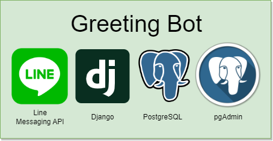
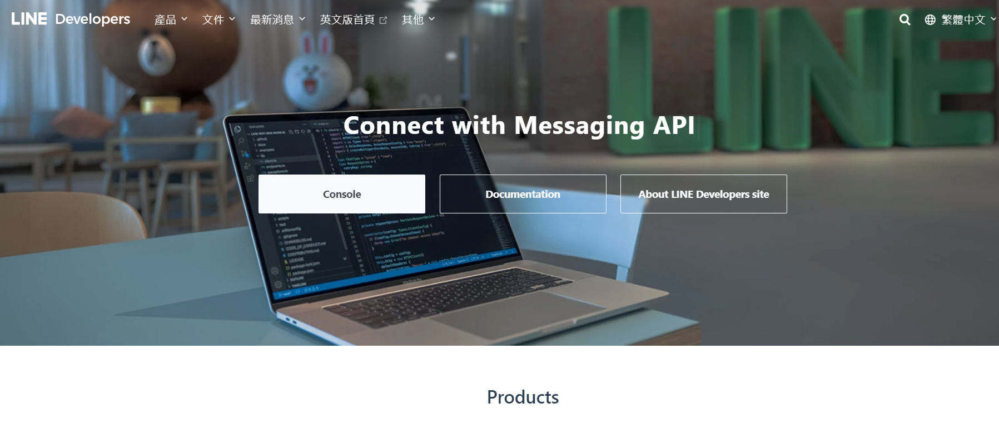
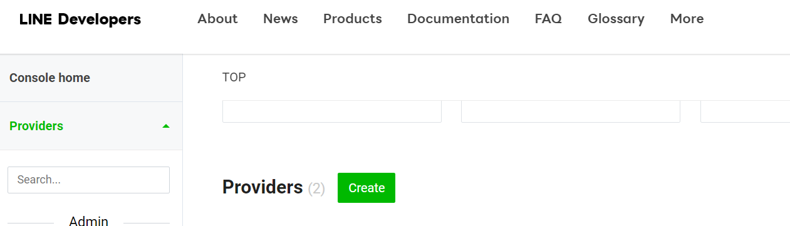
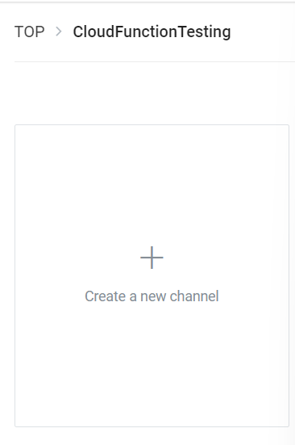
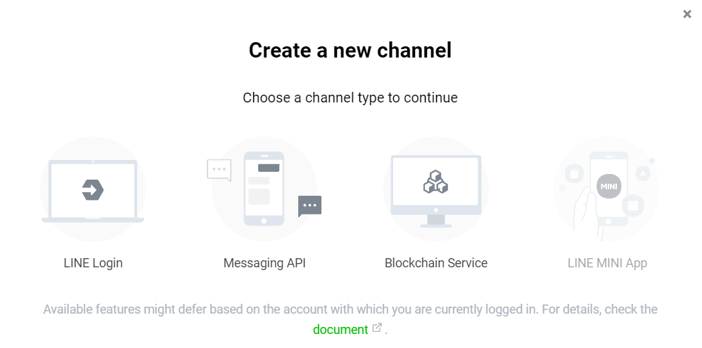
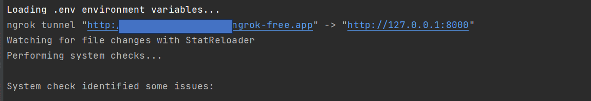

# Greeting Bot 

> Author:FKT

Apache License


---

## Core Tech Stack



- Django 4
- line-bot-sdk
- PostgresSQL
- pgAdmin

---

## Getting Start

### Step.1 Install Dependencies and setup Environment

Install Python Dependencies
```shell
pipenv install
```
Setup Environment
```shell
docker-compose up -d
```

### Step.2 Setup LINE bot account

Go to [LINE Developer](https://developers.line.biz/zh-hant/)
and click console !!


Create LINE account Provider



Create new channel



Select Messaging API
and Fill out your LINE bot information!!


### Step.3 Copy Channel Secret and Channel Access Token

These kinds of information are for LINE bot authentication
We save then into our **_.env_** file 

```shell
LINE_CHANNEL_ACCESS_TOKEN=XXXXX
LINE_CHANNEL_SECRET=XXX
```

and don't forget to complete full .env file
please reference **_.env.example_**

### Step.4 Runserver

```shell
pipenv run python manage.py runserver
```

After runserver pyngrok will display a external address then copy it to LINE bot **_webhook_url_** and append **/api/callback/**




---

## Testing

### Build Test Database

Execute python script 

```shell
pipenv run python manage.py create_test_db
```

### Test with test script

```shell
python manage.py test GreetingBot.test [--verbosity 2]# Unit Test --verbosity 2 is output detail
python manage.py test api.tests.unit [--verbosity 2]# Unit Test --verbosity 2 is output detail
python manage.py test api.tests.integration #Intergration Test
python manage.py test  #All Test
```